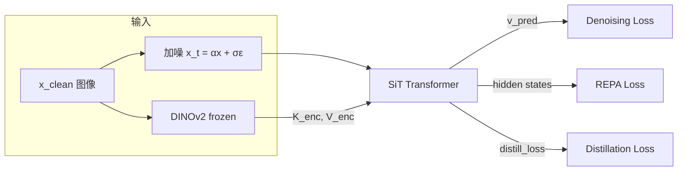

# SIT: Encoder KV Distillation for Accelerated Diffusion Training

## Core Idea

在 SiT (flow-matching DiT) 的 attention 层中注入预训练视觉编码器（DINOv2）的 Key/Value，让模型快速获得语义感知能力，显著加速训练收敛。



---

## 两阶段训练

### Stage 1: Encoder KV 注入

直接用 encoder 的 K/V 替代 SiT 自身的 K/V 做 attention：

```python
# Stage 1: 用 encoder 的 KV
if stage == 1 and k_enc is not None:
    k = k_enc    # 来自 DINOv2(x_clean) 的 Key
    v = v_enc    # 来自 DINOv2(x_clean) 的 Value
```

因为 K_enc/V_enc 来自**干净图像**，包含完整语义信息，denoising loss 大幅降低（~0.5 vs 正常 ~0.8）。

### Stage 2: Self-Attention + Distillation

切回 SiT 自己的 K/V，同时用 distillation loss 保持与 encoder 的语义对齐：

```python
# Stage 2: 用自己的 KV + 计算对齐损失
elif stage == 2 and k_enc is not None:
    distill_loss = compute_alignment(q, k_sit, v_sit, k_enc, v_enc)
    k = k_sit
    v = v_sit
```

```
Step:   0        stage1_steps              total_steps
        |  Stage 1  |      Stage 2           |
KV:     | K_enc     |  K_sit + distill_loss  |
```

---

## 损失函数

$$\mathcal{L} = \mathcal{L}_{\text{denoise}} + \lambda_{\text{proj}} \cdot \mathcal{L}_{\text{REPA}} + \lambda_{\text{distill}} \cdot \mathcal{L}_{\text{distill}}$$

### 1. Denoising Loss

标准 v-prediction 目标（flow matching）。

### 2. REPA Projection Loss

对齐 SiT 中间层 hidden states 与 DINOv2 patch features，直接改善特征质量。

### 3. Distillation Loss（核心贡献）


#### `attn_mse` — Attention Output 对齐

$$\mathcal{L}_{\text{attn\_mse}} = \text{MSE}\Big(\text{SDPA}(Q, K_{\text{sit}}, V_{\text{sit}}),\ \text{SDPA}(Q, K_{\text{enc}}, V_{\text{enc}})\Big)$$

```python
attn_enc = SDPA(Q, K_enc, V_enc)
attn_sit = SDPA(Q, K_sit, V_sit)
L = MSE(attn_sit, attn_enc.detach())
```


## Encoder KV 提取与投影

### 提取：Forward Hook

用 hook 从 frozen DINOv2 指定层截获 K/V，无需修改 encoder 代码：

```python
class EncoderKVExtractor:
    def forward(self, x_clean):
        _ = self.encoder(x_clean)       # 触发 hooks
        return self.collected_kv_list   # [(K_l, V_l), ...]
```

### 投影：维度对齐

Encoder (DINOv2-B: dim=768, heads=12) 与 SiT-XL (dim=1152, heads=16) 维度不同，需要投影：

```python
class EncoderKVProjection(nn.Module):
    def forward(self, k_enc, v_enc, stage):
        k_proj = self.k_proj(k_enc)  # → (B, sit_heads, N, head_dim)
        v_proj = self.v_proj(v_enc)
        if stage == 2:
            k_proj = k_proj.detach()  # Stage 2: 不更新投影层
            v_proj = v_proj.detach()
        return k_proj, v_proj
```

> **关键设计**：Stage 2 中 `detach()` 投影层，确保 distillation 梯度只更新 SiT 的 QKV，不改变投影映射。

---

## 完整训练循环

```python
for step in training:
    # 1. 自动阶段切换
    stage = 1 if step < stage1_steps else 2
    distill_coeff = distill_coeff if stage == 2 else 0.0

    # 2. 可选后期 align mode 切换
    if stage == 2 and step >= align_switch_step:
        align_mode = align_mode_late

    # 3. Encoder KV 提取（frozen，无梯度）
    with torch.no_grad():
        enc_kv_list = encoder_extractor(x_clean)

    # 4. 模型前向
    v_pred, zs, distill_loss = model(
        x_t, t, y,
        enc_kv_list=enc_kv_list,
        stage=stage,
        align_mode=align_mode,
    )

    # 5. 总损失
    loss = denoising_loss + proj_coeff × repa_loss + distill_coeff × distill_loss
```