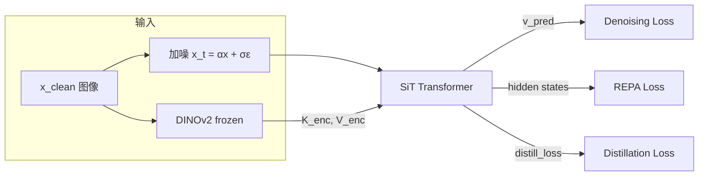

# SIT: Encoder KV Distillation for Accelerated Diffusion Training

## Core Idea

在 SiT (flow-matching DiT) 的 attention 层中注入预训练视觉编码器（DINOv2）的 Key/Value，让模型快速获得语义感知能力，显著加速训练收敛。



---

## 两阶段训练

### Stage 1: Encoder KV 注入

直接用 encoder 的 K/V 替代 SiT 自身的 K/V 做 attention：

```python
# Stage 1: 用 encoder 的 KV
if stage == 1 and k_enc is not None:
    k = k_enc    # 来自 DINOv2(x_clean) 的 Key
    v = v_enc    # 来自 DINOv2(x_clean) 的 Value
```

因为 K_enc/V_enc 来自**干净图像**，包含完整语义信息，denoising loss 大幅降低（~0.5 vs 正常 ~0.8）。

### Stage 2: Self-Attention + Distillation

切回 SiT 自己的 K/V，同时用 distillation loss 保持与 encoder 的语义对齐：

```python
# Stage 2: 用自己的 KV + 计算对齐损失
elif stage == 2 and k_enc is not None:
    distill_loss = compute_alignment(q, k_sit, v_sit, k_enc, v_enc)
    k = k_sit
    v = v_sit
```

```
Step:   0        stage1_steps              total_steps
        |  Stage 1  |      Stage 2           |
KV:     | K_enc     |  K_sit + distill_loss  |
```

---

## 损失函数

$$\mathcal{L} = \mathcal{L}_{\text{denoise}} + \lambda_{\text{proj}} \cdot \mathcal{L}_{\text{REPA}} + \lambda_{\text{distill}} \cdot \mathcal{L}_{\text{distill}}$$

### 1. Denoising Loss

标准 v-prediction 目标（flow matching）。

### 2. REPA Projection Loss

对齐 SiT 中间层 hidden states 与 DINOv2 patch features，直接改善特征质量。

### 3. Distillation Loss（核心贡献）

提供多种对齐模式。

#### `attn_mse` — Attention Output 对齐

$$\mathcal{L}_{\text{attn\_mse}} = \text{MSE}\Big(\text{SDPA}(Q, K_{\text{sit}}, V_{\text{sit}}),\ \text{SDPA}(Q, K_{\text{enc}}, V_{\text{enc}})\Big)$$

```python
attn_enc = SDPA(Q, K_enc, V_enc)
attn_sit = SDPA(Q, K_sit, V_sit)
L = MSE(attn_sit, attn_enc.detach())
```

- ✅ 简单高效，早期快速收敛
- ❌ ~100k 步后收敛到 ~0.008，无法提供持续信号

#### `attn_hybrid` — SNR-Gated Hybrid 对齐 ⭐ 推荐

$$\mathcal{L}_{\text{hybrid}} = \lambda_{\text{attn}} \cdot \mathcal{L}_{\text{attn\_mse}} + \lambda_{\text{kv}} \cdot w(t) \cdot \Big[\text{MSE}(K_{\text{sit}}, K_{\text{enc}}) + \text{MSE}(V_{\text{sit}}, V_{\text{enc}})\Big]$$

```python
# Attention output 对齐（容易，提供快启动信号）
attn_loss = MSE(attn_sit, attn_enc)

# SNR 加权 KV 直接对齐（更难，持续提供信号）
kv_loss = w(t) × [MSE(K_sit, K_enc) + MSE(V_sit, V_enc)]

# 组合
L = λ_attn × attn_loss + λ_kv × kv_loss
```

**SNR 权重**的动机：K_enc 来自干净图像，K_sit 来自噪声 x_t。高噪声时 x_t 信息不足，K_sit **物理上无法匹配** K_enc → 用 SNR 权重自动降低这些 timestep 的约束。

$$w(t) = \left(\frac{\text{SNR}(t)}{\text{SNR}(t) + 1}\right)^{\gamma}, \quad \text{SNR}(t) = \frac{\alpha_t^2}{\sigma_t^2}$$

```python
def _snr_weight(self, time_input, path_type):
    t = time_input.float()
    alpha_t = 1 - t          # signal coefficient
    sigma_t = t              # noise coefficient
    snr = alpha_t ** 2 / (sigma_t ** 2 + 1e-6)
    weight = (snr / (snr + 1.0)) ** gamma
    return clamp(weight, min=min_weight, max=1.0)
```

| 噪声 t | SNR | weight (γ=1) | weight (γ=2) |
|---|---|---|---|
| 0.0 (干净) | ∞ | 1.00 | 1.00 |
| 0.3 | 5.4 | 0.84 | 0.71 |
| 0.5 | 1.0 | 0.50 | 0.25 |
| 0.8 | 0.06 | 0.06 | 0.003 |
| 1.0 (纯噪声) | 0 | 0.00 | 0.00 |

#### `attn_kl` — Attention 分布 KL 散度

$$\mathcal{L}_{\text{attn\_kl}} = \tau^2 \cdot D_{\text{KL}}\Big(\text{softmax}(\frac{QK_{\text{sit}}^T}{\tau}) \| \text{softmax}(\frac{QK_{\text{enc}}^T}{\tau})\Big)$$

```python
target = softmax(Q·K_enc^T / τ).detach()
log_probs = log_softmax(Q·K_sit^T / τ)
L = τ² × KL(log_probs, target)
```

- τ < 1 锐化分布，对齐更难收敛
- **不约束 V**，适合作为辅助目标

---

## Encoder KV 提取与投影

### 提取：Forward Hook

用 hook 从 frozen DINOv2 指定层截获 K/V，无需修改 encoder 代码：

```python
class EncoderKVExtractor:
    def forward(self, x_clean):
        _ = self.encoder(x_clean)       # 触发 hooks
        return self.collected_kv_list   # [(K_l, V_l), ...]
```

### 投影：维度对齐

Encoder (DINOv2-B: dim=768, heads=12) 与 SiT-XL (dim=1152, heads=16) 维度不同，需要投影：

```python
class EncoderKVProjection(nn.Module):
    def forward(self, k_enc, v_enc, stage):
        k_proj = self.k_proj(k_enc)  # → (B, sit_heads, N, head_dim)
        v_proj = self.v_proj(v_enc)
        if stage == 2:
            k_proj = k_proj.detach()  # Stage 2: 不更新投影层
            v_proj = v_proj.detach()
        return k_proj, v_proj
```

> **关键设计**：Stage 2 中 `detach()` 投影层，确保 distillation 梯度只更新 SiT 的 QKV，不改变投影映射。

---

## 完整训练循环

```python
for step in training:
    # 1. 自动阶段切换
    stage = 1 if step < stage1_steps else 2
    distill_coeff = distill_coeff if stage == 2 else 0.0

    # 2. 可选后期 align mode 切换
    if stage == 2 and step >= align_switch_step:
        align_mode = align_mode_late

    # 3. Encoder KV 提取（frozen，无梯度）
    with torch.no_grad():
        enc_kv_list = encoder_extractor(x_clean)

    # 4. 模型前向
    v_pred, zs, distill_loss = model(
        x_t, t, y,
        enc_kv_list=enc_kv_list,
        stage=stage,
        align_mode=align_mode,
    )

    # 5. 总损失
    loss = denoising_loss + proj_coeff × repa_loss + distill_coeff × distill_loss
```

---

## 实验结果

| Model | Steps | FID ↓ | sFID ↓ | IS ↑ | Precision | Recall |
|---|---|---|---|---|---|---|
| SiT-XL/2 | 7M | 8.30 | 6.32 | 131.7 | 0.68 | 0.67 |
| +REPA | 4M | 5.90 | 5.73 | 157.8 | 0.70 | 0.69 |
| **+Ours** | **100k** | 12.00 | **5.27** | 94.8 | 0.69 | 0.61 |
| **+Ours** | **200k** | 8.47 | **5.01** | 117.8 | 0.70 | 0.63 |
| **+Ours** | **400k** | 7.08 | **5.25** | 132.1 | 0.70 | 0.65 |

- **sFID**：100k 步即超越 REPA 4M 和 SiT 7M
- **FID**：400k 步超越 SiT 7M，训练效率提升 **17.5×**

---

## 推荐训练配置

```bash
python train.py \
    --model SiT-XL/2-EncoderKV \
    --encoder-type dinov2-b \
    --enc-layer-indices "11" \
    --sit-layer-indices "10" \
    --stage1-steps 100000 \
    --distill-coeff 4.0 \
    --align-mode attn_hybrid \
    --kv-distill-snr-gamma 2.0 \
    --kv-distill-min-weight 0.05 \
    --attn-loss-weight 1.0 \
    --kv-loss-weight 0.5 \
    --max-train-steps 400000
```
